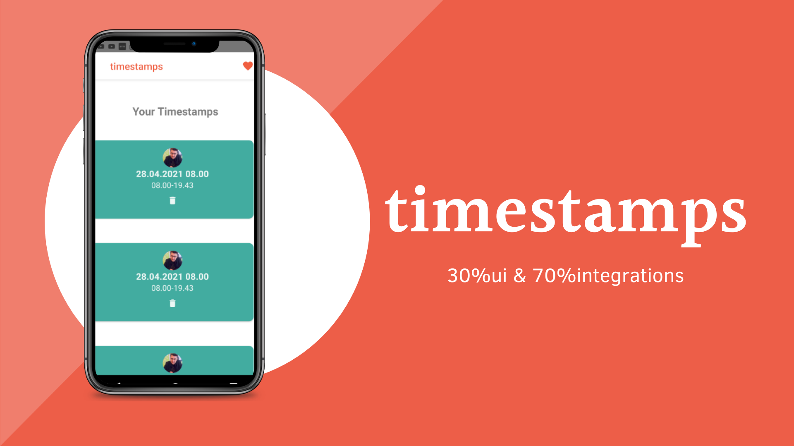
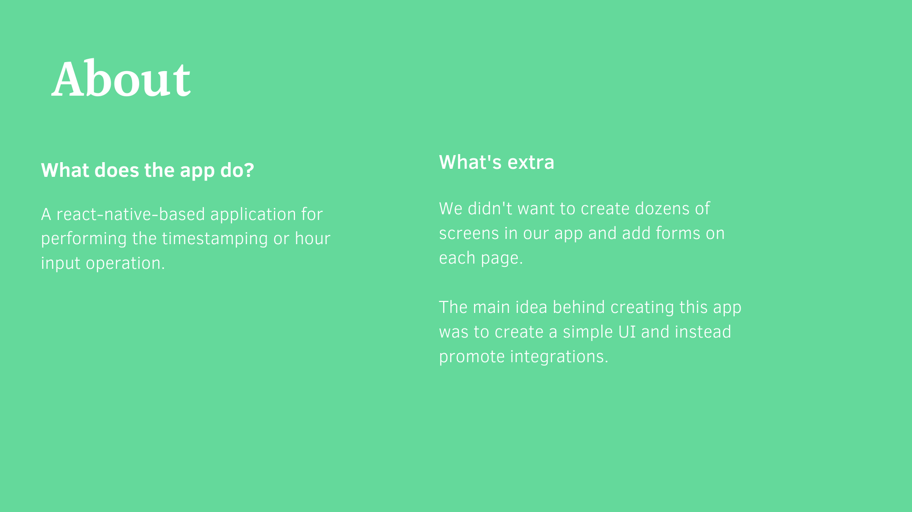
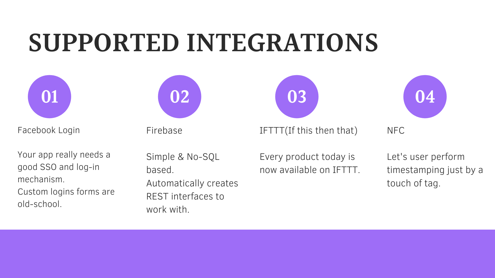
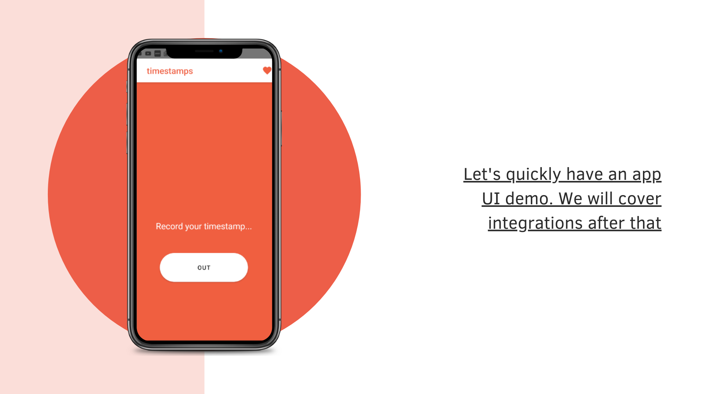

<h2>Timestamping React Native Application</h2>

Create new project
========================================
npx react-native init Timestamping

google-services.json
===========================
Check if project url is present else add:
"firebase_url": "https://timestamps-aaddf-default-rtdb.firebaseio.com"

changes in MainActivity.java
======================================
import com.facebook.react.ReactActivityDelegate;
import com.facebook.react.ReactRootView;
import com.swmansion.gesturehandler.react.RNGestureHandlerEnabledRootView;

@Override
  protected ReactActivityDelegate createReactActivityDelegate() {
    return new ReactActivityDelegate(this, getMainComponentName()) {
      @Override
      protected ReactRootView createRootView() {
       return new RNGestureHandlerEnabledRootView(MainActivity.this);
      }
    };
  }
  
  
Vector icons not showing
===================================
react-native link react-native-vector-icons
  
  
In AndroidManifest.xml
=================================
NFC related changes
<uses-permission android:name="android.permission.NFC" />
<intent-filter>
	<action android:name="android.intent.action.VIEW" />
	<category android:name="android.intent.category.DEFAULT" />
	<category android:name="android.intent.category.BROWSABLE" />
	<data android:scheme="timestamp" android:host="toggle"/>
</intent-filter>

<intent-filter>
	<action android:name="android.nfc.action.NDEF_DISCOVERED"/>
	<category android:name="android.intent.category.DEFAULT"/>
</intent-filter>

<intent-filter>
	<action android:name="android.nfc.action.TECH_DISCOVERED"/>
</intent-filter>

FB Login related changes(will be told in setup wizard):
<meta-data android:name="com.facebook.sdk.ApplicationId" android:value="@string/facebook_app_id"/>

FB Login related changes In strings.xml(will be told in setup wizard)
====================================
<string name="facebook_app_id">209034510719349</string>
<string name="fb_login_protocol_scheme">fb209034510719349</string>

Key Hash for Facebook Login
==========================================
keytool -exportcert -alias timestamp -keystore "C:\Users\dhruv.pandey\Desktop\hackathon\Timestamping\android\app\debug.keystore" | openssl sha1 -binary | openssl base64

Keystore pass: android

Gradle related changes(quite important and confusing)
=========================================================
For Firebase DB(Given in setup wizard):
Project-level build.gradle (<project>/build.gradle):
buildscript {
  repositories {
    // Check that you have the following line (if not, add it):
    google()  // Google's Maven repository
  }
  dependencies {
    ...
    // Add this line
    classpath 'com.google.gms:google-services:4.3.5'
  }
}

allprojects {
  ...
  repositories {
    // Check that you have the following line (if not, add it):
    google()  // Google's Maven repository
    ...
  }
}
App-level build.gradle (<project>/<app-module>/build.gradle):
apply plugin: 'com.android.application'
// Add this line
apply plugin: 'com.google.gms.google-services'

dependencies {
  // Import the Firebase BoM
  implementation platform('com.google.firebase:firebase-bom:27.1.0')
    implementation 'com.google.firebase:firebase-database'

  // Add the dependencies for the desired Firebase products
  // https://firebase.google.com/docs/android/setup#available-libraries
}

For FB Login:
Project-level build.gradle (<project>/build.gradle):
buildscript {
    ext {
        buildToolsVersion = "29.0.3"
        minSdkVersion = 21
        compileSdkVersion = 29
        targetSdkVersion = 29
        ndkVersion = "20.1.5948944"
    }
    repositories {
        mavenCentral()			//ADD THIS
        google()
        jcenter()
    }

App-level build.gradle (<project>/<app-module>/build.gradle):

dependencies {
    implementation fileTree(dir: "libs", include: ["*.jar"])
    //noinspection GradleDynamicVersion
    implementation "com.facebook.react:react-native:+"  // From node_modules
    implementation 'com.facebook.android:facebook-android-sdk:[5,6)'			//ADD THIS

Start Metro server
=============================
react-native start --port=8088

Run App
==================
react-native run-android --port=8088
